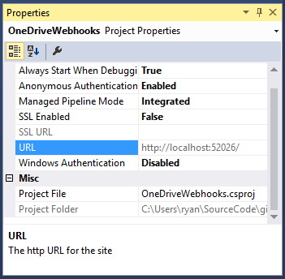
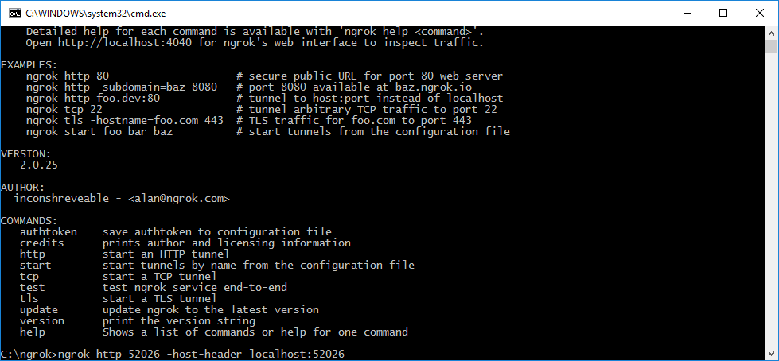
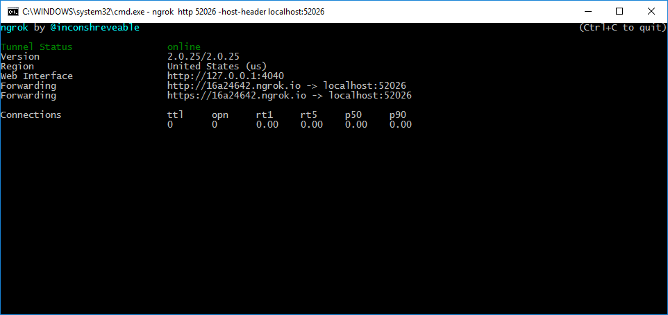
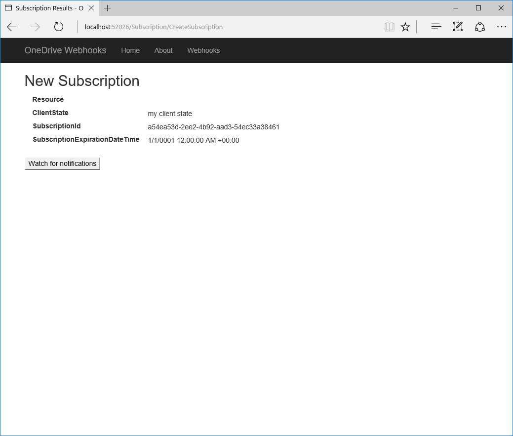
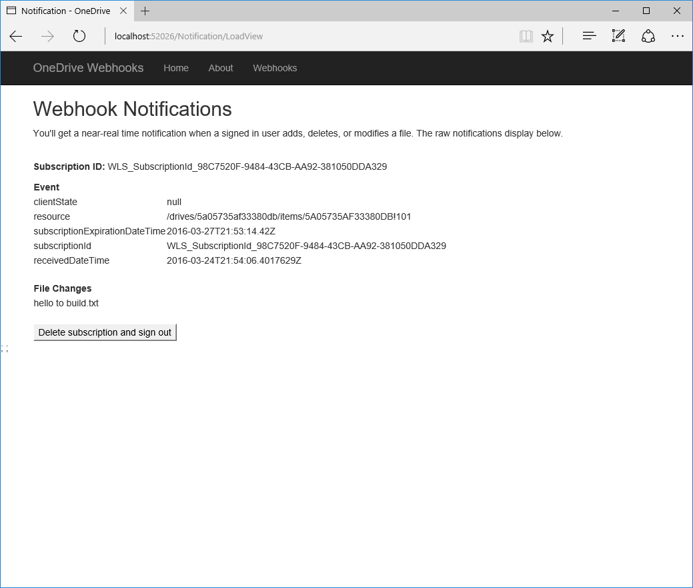

# OneDrive Webhooks ASP.NET Sample

This ASP.NET MVC sample shows how to receive notifications from OneDrive
and OneDrive for Business when changes occur to files. The following are common
tasks that a web application performs with OneDrive webhooks.

* Sign-in your users with their Microsoft account, or a work or school account to get an access token.
* Use the access token to create a webhook subscription.
* Send back a validation token to confirm the notification URL.
* Listen for notifications from OneDrive.
* Request for more information using data in the notification.

This sample subscribes to notification on the signed in user's OneDrive and
displays the name of the files that were added, modified, or deleted when a
notification is received.

**Note:** Webhooks are still being enabled as a _preview only_ on OneDrive for Business. Webhooks functionality may not be available for your tenant yet. You can use a OneDrive Personal account to test functionality if this is the case.

## Prerequisites

To use the OneDrive Webhooks sample, you need the following:

* Visual Studio 2015 with Update 1 installed on your development computer.

* A public HTTPS endpoint to receive and send HTTP requests. You can use
  Microsoft Azure or another service to host your endpoint. If you prefer, you
  can use ngrok (or a similar tool) while testing to temporarily allow messages
  from Microsoft Graph to tunnel to a port on your local computer.
  [Instructions for setting up ngrok](#set-up-the-ngrok-proxy-optional-) are included below.

* A client ID and key for two applications:
  * To enable OneDrive Personal support, you need to register an application at the [Microsoft registration portal](account.live.com/developers/applications).
  * To enable OneDrive for Business support, you need to register an application
    through a Microsoft Azure Active Directory tenant. You can use the
    [Office 365 app registration tool](https://dev.office.com/app-registration),
    which simplifies the process. Use the following parameters:

    | Parameter       | Value                   |
    |:----------------|:------------------------|
    |        App type | Web App                 |
    |     Sign on URL | http://localhost:52026/ |
    |    Redirect URI | http://localhost:52026/ |
    | App permissions | Files.ReadWrite         |

   Copy and store the returned **Client ID** and **Client Secret** values.

### Set up the ngrok proxy (optional)

You must expose a public HTTPS endpoint to create a subscription and receive
notifications from OneDrive. While testing, you can use ngrok to
temporarily allow messages from OneDrive to tunnel to a *localhost* port
on your computer. To learn more about using ngrok, see the [ngrok website](https://ngrok.com/).  

1. In Solution Explorer, select the **OneDriveWebhooks** project.

2. Copy the **URL** port number from the **Properties** window.  If the **Properties** window isn't showing, choose **View/Properties Window**.

   

3. [Download ngrok](https://ngrok.com/download) for Windows.  

4. Unzip the package and run ngrok.exe.

5. Replace the two *<port-number>* placeholder values in the following command with the port number you copied, and then run the command in the ngrok console.

   ```
   ngrok http <port-number> -host-header=localhost:<port-number>
   ```

   

6. Copy the HTTPS URL that's shown in the console.

   

   >Keep the console open while testing. If you close it, the tunnel also closes
   >and you'll need to generate a new URL and update the sample.

## Configure and run the sample

1. Create a public HTTPS notification endpoint. It can run on a service such as
   Microsoft Azure, or you can create a proxy web server by [using ngrok](#ngrok)
   or a similar tool.

2. Open **onedrive-webhooks-aspnet.sln** in the sample files.

3. In Solution Explorer, open the **Web.config** file in the root directory of the project.
  a. Enter the values for your registered applications client ID into **ida:AppId**.
  b. Enter the values for your registered applications client secret / password into **ida:AppSecret**.
  c. For the **ida:NotificationUrl** key, replace *ENTER_YOUR_URL* with your
     HTTPS URL. Keep the */notification/listen* portion. If you're using ngrok, the
     value will look something like this:

  ```xml
  <add key="ida:NotificationUrl" value="https://0f6fd138.ngrok.io/notification/listen" />
  ```

4. Make sure that the ngrok console is still running, then press F5 to build and
   run the solution in debug mode.


### Use the app

1. Sign in with your Office 365 work or school account.

2. Choose the **Create subscription** button. The **Subscription** page loads
   with information about the subscription.

   

3. Choose the **Watch for notifications** button.

4. Add or modify a file in your OneDrive account. The **Notification** page
   displays some message properties. It may take several seconds for the page to update.

   

5. Choose the **Delete subscription and sign out** button.


## Key components of the sample

The following files contain code that shows how to work with OneDrive webhooks.

**Controllers**  
- [`NotificationController.cs`](OneDriveWebhooks/Controllers/NotificationController.cs) Receives notifications.  
- [`SubscriptionContoller.cs`](OneDriveWebhooks/Controllers/SubscriptionController.cs) Creates and receives webhook subscriptions.

**Models**  
- [`OneDriveNotification.cs`](OneDriveWebhooks/Models/OneDriveNotification.cs) Represents a change notification.
- [`OneDriveSubscription.cs`](OneDriveWebhooks/Models/OneDriveSubscription.cs) Represents a webhook subscription. Also defines the **SubscriptionViewModel** that represents the data displayed in the Subscription view.

**Views**  
- [`Notification/Notification.cshtml`](OneDriveWebhooks/Views/Notification/Notification.cshtml) Displays information about received messages, and contains the **Delete subscription and sign out** button.
- [`Subscription/Index.cshtml`](OneDriveWebhooks/Views/Subscription/Index.cshtml) Landing page that contains the **Create subscription** button.
- [`Subscription/CreateSubscription.cshtml```](OneDriveWebhooks/Views/Subscription/Subscription.cshtml) Displays subscription properties, and contains the **Watch for notifications** button.

**Other**  
- [`Web.config`](OneDriveWebhooks/Web.config) Contains values used for authentication and authorization.
- [`Startup.cs`](OneDriveWebhooks/App_Start/Startup.cs) Contains code used for authentication and authorization when the app starts. The sample uses [OpenID Connect](https://msdn.microsoft.com/en-us/library/azure/jj573266.aspx) to authenticate and authorize the user.

## Troubleshooting

| Issue                                                                                             | Resolution                                                                                      |
|:--------------------------------------------------------------------------------------------------|:------------------------------------------------------------------------------------------------|
| The app opens to a *Server Error in '/' Application. The resource cannot be found.* browser page. | Make sure that a CSHTML view file isn't the active tab when you run the app from Visual Studio. |


## Questions and comments

We'd love to get your feedback about OneDrive Webhooks ASP.NET
sample. You can send your questions and suggestions to us in the [Issues](https://github.com/OneDrive/onedrive-webhooks-aspnet)
section of this repository.

Questions about OneDrive or Office 365 in general should be posted to [Stack Overflow](http://stackoverflow.com/questions/tagged/OneDrive+Office365).
Make sure that your questions or comments are tagged with *OneDrive* or *Office365*.

You can suggest changes for OneDrive on [UserVoice](onedrive.uservoice.com/forums/262982-onedrive/category/89523-developer).


## Additional resources

* [OneDrive API Reference](https://dev.onedrive.com/README.htm)
* [Office 365 Developer Portal](https://dev.office.com)

## License

See [LICENSE](LICENSE.md) for the license for this sample code.
